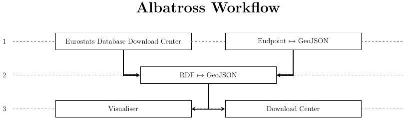

Description
===========

The application has two parts, first of all, the given (3-star) Open Data (focusing NUTS-3 datasets - `Estimated soil erosion by water`_, `Manure storage facilities`_ and `Structure of agricultural holdings`_) will be transformed into `5-star Open Data`_, by means of RDF transformation.

The focus on geospatial and temporal Open Data opens the possibility to use `RDF Cubes`_ for that purpose.
We test an automated approach to link these cubes, using a `LIMES`_ service. The goal is to deliver an application, that automates this process.

The second step is to use this RDF data and visualise them. The visualisation will have two integrated components. On the one hand the data will be visible on a Map (using bokeh), and one the other hand the data will be visualised as charts (e.g. temporal development bar chart). 

The charts will be configurable to visualised the right information for user purposes. The map visualisation will be dynamic with zooming functions and flexible hover information about target regions (local Polygons and NUTS-3 Regions). 

The application additionally will have the feature to download this visualisation in graphical formats (PNG), RDFs and GeoJSONs.

In App Workflow
---------------

.. _Estimated soil erosion by water: https://data.europa.eu/euodp/en/data/dataset/L3AfXzHroGVUIo1xzwJlw
.. _Manure storage facilities: http://appsso.eurostat.ec.europa.eu/nui/show.do?dataset=aei_fm_ms&lang=en
.. _Structure of agricultural holdings: http://appsso.eurostat.ec.europa.eu/nui/show.do?dataset=ef_r_nuts&lang=en
.. _5-star Open Data: http://5stardata.info/en/
.. _RDF Cubes: https://www.w3.org/TR/vocab-data-cube/
.. _LIMES: https://github.com/dice-group/LIMES